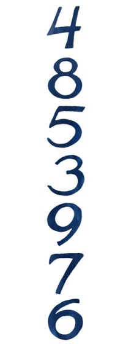
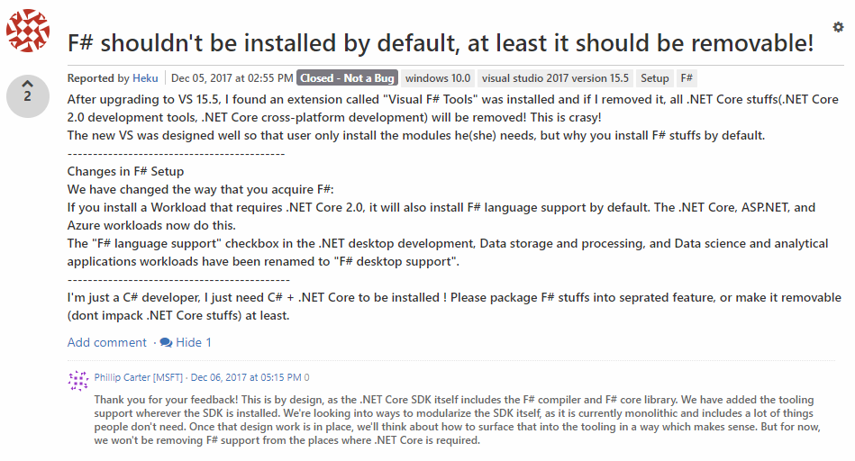

- title : Why we love and use F#
- description : Introduction to F#
- author : Dragan Jovanović & Branimir Momčilović
- theme : night
- transition : default

***

## Why we love and use F#

 
 
 
 
Branimir Momčilović - [@bramom](http://www.twitter.com/bramom)  
Dragan Jovanović - [draganjovanovic1](https://github.com/draganjovanovic1)  

***

### Agenda

* Motivation: Should I learn a new programming language?
* Why F#
 * F# history
 * F# language overview
 * Community, libraries
 * Real world examples, demos
* How to start?

---

#### Thanks to:  
* [F# for fun and profit by Scott Wlaschin](https://fsharpforfunandprofit.com/)
* [Beginning F# 4.0 by Robert Pickering and Kit Eason](https://www.apress.com/gp/book/9781484213759)  
* [How to (and not to) give a talk on F# by Ted Neward](http://blogs.tedneward.com/post/how-to-and-not-to-give-a-talk-on-f/)

' Thanks these guys for inspiring us

***

### Why I should learn a new programming language?

*From The Pragmatic Programmer, Tip #8*  

"Invest Regularly in Your Knowledge Portfolio":  
Learn at least one new language every year. Different languages solve the same problems in different ways. By learning several different approaches, you can help broaden your thinking and avoid getting stuck in a rut. Additionally, learning many languages is far easier now, thanks to the wealth of freely available software on the Internet  

' https://en.wikipedia.org/wiki/Turing_completeness https://en.wikipedia.org/wiki/Lambda_calculus
' In computability theory, a system of data-manipulation rules is said to be Turing complete or computationally universal if it can be used to simulate any Turing machine. A classic example is lambda calculus. A closely related concept is that of Turing equivalence – two computers P and Q are called equivalent if P can simulate Q and Q can simulate P.

---

### Importance of Language

Here are seven random numbers. Sort of like a telephone number, but arranged vertically. Take a glance — just a glance — then pause, take out a piece of paper and see how many you can recall.

Done?

---

### Asian children find it easier to learn to count than Europeans

According to the French neurologist and mathematician Stanislas Dehaene, about 50 percent of English speakers can remember all seven numbers.  

Experiments have repeatedly shown that Asian children find it easier to learn to count than Europeans. In one study with Chinese and American 4- and 5-year-olds, the two nationalities performed similarly when learning to count to 12, but the Chinese were about a year ahead with higher numbers. A regular system (of number-words) also makes arithmetic clearer to understand.

* [China's Numbers Are Shorter Than Ours by Robert Krulwich](https://www.npr.org/sections/krulwich/2011/07/01/137527742/china-s-unnatural-math-advantage-their-words)

' If, however, you are a Chinese speaker, you tend to do much better. The average Chinese speaker can memorize nine numbers in this same amount of time.  

---

### Why The Difference?

The difference, says Dehaene, is how the words sound in your head. The Chinese words for the first nine numbers are all short, concise and bullet-like: "yi," "er," "san," "si," "wu," "liu," "qi," "ba," "jiu." He timed them and they average about a quarter of a second each.  

In English we start with "one", "two", but "three" can stretch out a bit and "seven" is a real slower-downer, being two syllables long, so the English number-words take a little longer, a third of a second each.

***

### What is F#

* F# is a mature, open source, cross-platform, functional-first programming language
  * Developed by Microsoft Research (Don Syme and his team)
  * Based on OCaml, influenced by C# and Haskell
 
   
- History
  * 2002: F# language design started
  * 2005: F# 1.01 released to public
  * 2010: F# is baked into VS 2010
  * 2017: .NET Core includes F# support by default

---

### .NET Core SDK includes the F# compiler and F# core library

***

### Why use F#

* __Conciseness__  
F# is not cluttered up with coding “noise” such as curly brackets.

* __Convenience__  
Many common programming tasks are much simpler in F#  

* __Correctness__  
F# has a powerful type system which prevents many common errors such as null reference exceptions.  

* __Concurrency__  
Asynchronous programming is very easy, as is parallelism.

* __Completeness__  
F# is designed as a hybrid functional/OO language, so it can do virtually everything that C# can do.

[F# for fun and profit by Scott Wlaschin](https://fsharpforfunandprofit.com/why-use-fsharp/)

' F# is not cluttered up with coding “noise” such as curly brackets, semicolons and so on. You almost never have to specify the type of an object, thanks to a powerful type inference system. And, compared with C#, it generally takes fewer lines of code to solve the same problem.

' Many common programming tasks are much simpler in F#. This includes things like creating and using complex type definitions, doing list processing, comparison and equality, state machines, and much more. Add because functions are first class objects, it is very easy to create powerful and reusable code by creating functions that have other functions as parameters, or that combine existing functions to create new functionality.

' F# has a powerful type system which prevents many common errors such as null reference exceptions. Values are immutable by default, which prevents a large class of errors. In addition, you can often encode business logic using the type system itself in such a way that it is actually impossible to write incorrect code or mix up units of measure, greatly reducing the need for unit tests.

' F# has a number of built-in libraries to help when more than one thing at a time is happening. Asynchronous programming is very easy, as is parallelism. F# also has a built-in actor model, and excellent support for event handling and functional reactive programming. And of course, because data structures are immutable by default, sharing state and avoiding locks is much easier.

' Although it is a functional language at heart, F# does support other styles which are not 100% pure, which makes it much easier to interact with the non-pure world of web sites, databases, other applications, and so on. In particular, F# is designed as a hybrid functional/OO language, so it can do virtually everything that C# can do. Of course, F# is part of the .NET ecosystem, which gives you seamless access to all the third party .NET libraries and tools. It runs on most platforms, including Linux and smart phones (via Mono). Finally, it is well integrated with Visual Studio, which means you get a great IDE with IntelliSense support, a debugger, and many plug-ins for unit tests, source control, and other development tasks. Or on Linux, you can use the MonoDevelop IDE instead.

---

### Demo

    // UPDATE

    let update (msg:Msg) (model:Model) =
        match msg with
        | Increment -> model + 1
        | Decrement -> model - 1

---

***

### Thank you!

* https://github.com/mocosha